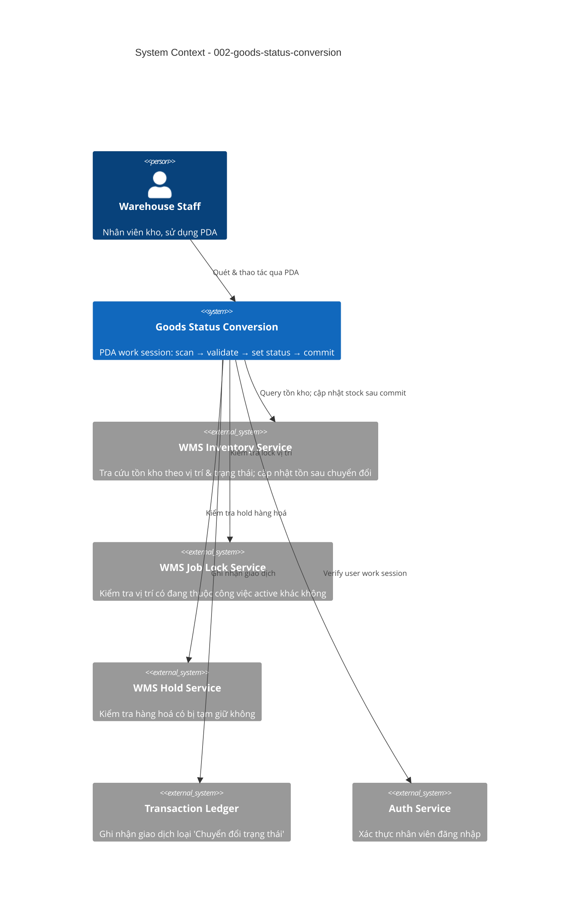

# Goods Status Conversion — System Context

## System Overview

Hệ thống cung cấp PDA flow cho nhân viên kho chuyển đổi trạng thái hàng hoá theo phiên có kiểm soát.
Nhân viên quét vị trí → quét hàng hoá → nhập trạng thái đích → quản lý danh sách → chốt phiên.
Khi chốt, tồn thực tế được cập nhật nguyên tử (trừ trạng thái nguồn / cộng trạng thái đích)
và mỗi chuyển đổi được ghi nhận dưới dạng giao dịch.

Phạm vi: **UT03 / WMS — Inventory** của nền tảng UpS.

## Context Diagram

## Actors

| Actor | Type | Mô tả |
|-------|------|-------|
| Warehouse Staff | Human | Nhân viên kho thực hiện chuyển đổi trạng thái trên PDA |

## External Integrations

| System | Direction | Data Exchanged | Protocol |
|--------|-----------|----------------|----------|
| WMS Inventory Service | Both | Query: danh sách hàng theo vị trí, tồn kho theo (SKU, location, status)  Write: deduct source status, add target status | REST |
| WMS Job Lock Service | Inbound query | Location ID → có/không active job khác | REST |
| WMS Hold Service | Inbound query | Item ID → có/không active hold | REST |
| Transaction Ledger | Outbound | Conversion record: staff, item, location, from_status, to_status, qty, note, timestamp | REST / Event |
| Auth Service | Inbound | User work session validation | JWT / existing auth |

## Data Flows

### Inbound
- Barcode scan từ PDA (location barcode, item barcode)
- User JWT / work session token
- Status input (target status, notes) từ form

### Outbound
- Stock mutations: `UPDATE inventory SET qty = qty - n WHERE (sku, location, status = source)`
  và `UPDATE inventory SET qty = qty + n WHERE (sku, location, status = target)` — atomic
- Transaction records: 1 record per successful conversion

## High-Level Constraints

- KHÔNG đồng bộ lên channel (Shopee, Lazada, TikTok) — chỉ ảnh hưởng internal WMS stock
- KHÔNG có approval workflow
- Không có transition matrix — mọi cặp source → target đều hợp lệ
- PDA-first UI (mobile, barcode scanner)

## Key NFR Goals

- Per-record atomicity khi commit (trừ + cộng trong 1 DB transaction)
- Partial failure tolerance: 1 record lỗi không rollback cả phiên
- Validation latency < 500ms trên PDA
- Full audit trail cho tất cả chuyển đổi thành công
